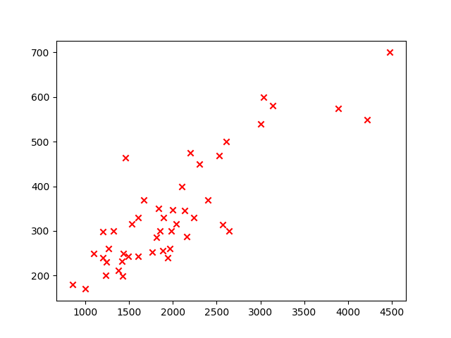
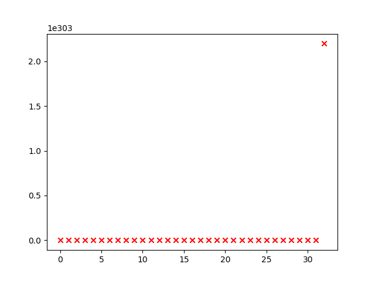

# 线性回归
本节主要根据吴恩达的机器学习课程采用实例
## 房屋价格预测
首先绘制一下数据的图示，[数据](dataset/data.txt)同样源于吴恩达机器学习课程中，我们利用matplotlib绘制数据图示
```
import matplotlib.pyplot as plt
x_train = []
y_train = []
with open('data.txt', 'r') as fp:
    lines = fp.readlines()
    print(len(lines))
    for line in lines:
        data_line = line.strip("\n").split(",") #strip去除首尾换行符，并用split划分，划分后产生一个列表
        x_train.append(int(data_line[0])) #size in feet to 2
        y_train.append(float(data_line[2])/1000) #price in 1000's
fp.close()
plt.figure()
plt.scatter(x_train, y_train, c='r', marker = 'x') #c设置颜色， marker设置点的样式，参数x, y
plt.show()
```

结果如下所示


## 损失函数(cost function)
在使用损失函数前，为统一运算，先将x_train 和 y_train转成矩阵的形式
```
m = len(y_train)
x_train = np.array(x_train).reshape(m, 1)
x_train = np.matrix(x_train)
y_train = np.array(y_train).reshape(m, 1)
y_train = np.matrix(y_train) #转成矩阵后进行矩阵运算
```
定义损失函数为平方误差函数，其代码如下
```
def cost_function(x, y, w, m):
    #x,y,w分别对应输入输出和权重矩阵

    return np.sum(np.square(np.dot(w, x.T) - y.T)) / (2*m) #numpy点乘表示矩阵内积，相减为矩阵减法,np.square表示对每个元素进行平方,np.array可即为行向量，也可为列向量，numpy会自动判断,此处我们x,y都为matrix
w = np.matrix(1)
print(cost_function(x_train, y_train, w, m))

output:
1611801.6326809255
```
## 梯度下降算法
梯度下降的具体公式这里不再做赘述，直接进入代码的实现
```
bias = np.ones(m) #这里我们把常数项也归到权重中，因此需要在输入的x中多加一维1
x_train = np.array(x_train).reshape(m, 1)
x_train = np.column_stack((x_train, bias)) #因为前面已经将x转为了列向量，因此接下来按列拼接即可
x_train = np.matrix(x_train)
y_train = np.array(y_train).reshape(m, 1)
y_train = np.matrix(y_train) #转成矩阵后进行矩阵运算
w = np.matrix([0, 0])
def batch_gradient_decent(x, y, w, m, itera):
    alph = 0.01
    temp = np.matrix(np.zeros(w.shape)) #生成中间变量矩阵
    cost = [0] * itera
    parameters = int(w.ravel().shape[1]) #数组展成1维，并返回形状
    for i in range(itera):
        cost[i] = cost_function(x, y, w, m)
        error = np.dot(w, x.T) - y.T
        for j in range(parameters): #更新每个参数
            term = np.multiply(error.T , x[:, j]) #对应相乘即可
            temp[0, j] = w[0, j] - alph / m * np.sum(term)
        w = temp #保证同时更新

    plot_figure(range(itera), cost)
```
这样情况下，输出其实是会报错的，显示overflow了，推测是因为没有归一化导致后面计算超过了表示范围，而且bgd算法似乎并没有收敛，下面两张图可以证明这一点。
我们都知道，当学习率取得过大时，bgd会取得相反的效果，当学习率为0.01时，得到的cost如下：



现在，当学习率取到0.00000001时，其损失如下：


显然，在此学习率下，函数缺失收敛了。
